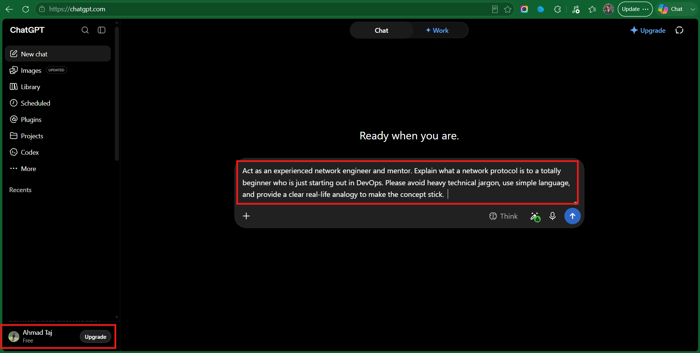
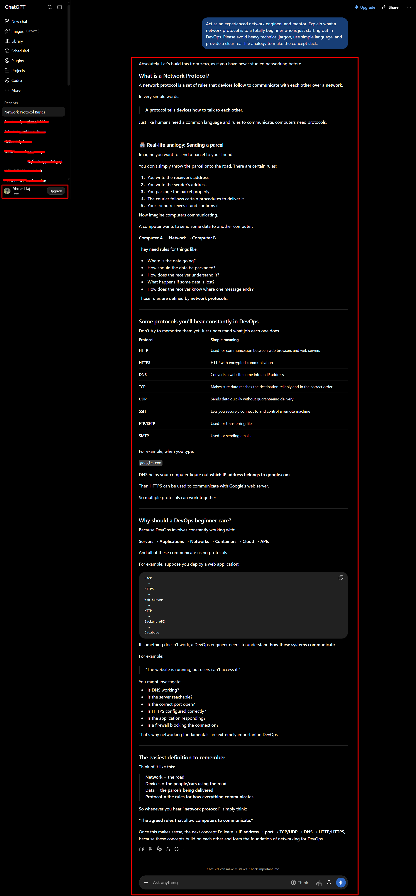
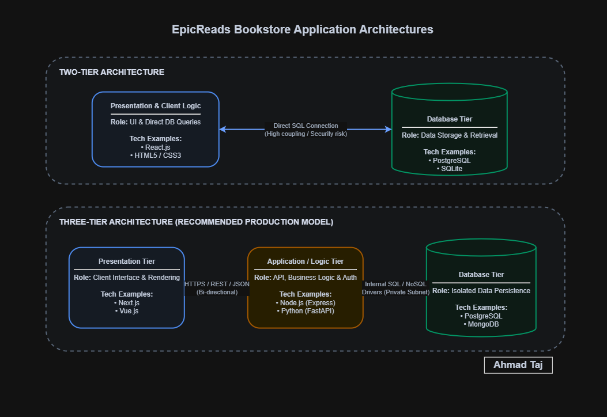
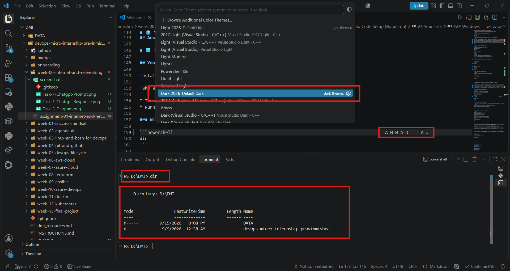

# Week 00 - Internet and Networking

Part of the DevOps Micro Internship (DMI) Cohort 3 with Agentic AI

---

# 🧑‍💻 Task 1: Using ChatGPT as Your Learning Assistant

## Scenario

You're new to DevOps and will frequently encounter technical questions. ChatGPT can be your learning companion.

## Your Task

Write a clear ChatGPT prompt to help you understand:

> "What is a protocol in networking? Explain with a simple real-life example."

Take a screenshot of your interaction showing:

* Your detailed prompt (with clear expectations)
* ChatGPT's simplified response with an example

## Screenshot

Prompt

Response



---

## What I Learned (2–3 lines)

I learned that network protocols are basically a set of rules that help computers communicate with each other. I also understood how different protocols like HTTP, HTTPS, DNS, and TCP are used for different types of communication.

---

# 🌐 Task 2: Internet and Networking

## Scenario

Your friend is launching an online bookstore named **EpicReads**.

He asked you to explain how users globally can access his website hosted in Finland.

## Your Task

Write a short explanation (**100–150 words**) that includes:

* Packet Switching
* IP Address
* TCP/IP
* HTTP/HTTPS

💡 **Tip:** You may use ChatGPT (as demonstrated in Task 1) to refine your explanation.

## Answer

When a reader in the United States loads EpicReads, their browser initiates an HTTPS request targeting the bookstore server stationed in Finland. This secure application layer protocol runs on top of TCP/IP. The IP address acts like a precise digital street address, routing the traffic through international transit providers and transatlantic fiber optic cables. Instead of traveling as one massive file, the data relies on packet switching. The web page assets get chopped up into thousands of individual data packets, each tagged with destination coordinates. These packets travel across multiple network hops independently along the fastest paths available. Once they reach the Finnish data center, TCP inspects every packet, confirms nothing dropped out in transit, puts them back in original order, and delivers the finished web page cleanly onto the user's screen.

---

# 🏗️ Task 3: Application Architecture & Stack

## Scenario

EpicReads bookstore has two application versions:

### Two-Tier Application

* Frontend
* Database

### Three-Tier Application

* Frontend
* Backend
* Database

## Your Task

* Draw simple diagrams (hand-drawn or tool-based such as draw.io)
* Label each layer clearly
* List at least two common technologies or tools used for each layer
* Submit a screenshot or photo clearly showing your own drawing

## Diagram Screenshot / Photo



---

## Technologies Used

### Frontend

* React.js
* HTML5 / CSS3

### Backend

* Node.js with Express
* Python with FastAPI

### Database

* PostgreSQL
* MongoDB

---

# 🌍 Task 4: Domain Name & DNS (Basic Concepts)

## Scenario

Your friend's bookstore **EpicReads** is currently accessible through:

```text
52.172.142.222:3000
```

He purchased the domain:

```text
epicreads.com
```

## Your Task

In **50–100 words**, explain in your own words:

1. What is DNS (Domain Name System)?
2. Which DNS record type should be used to connect the domain to the given IP, and why?

## Answer

1. The Domain Name System functions as the phonebook of the modern web. Computers navigate by numeric IP addresses, but humans remember words like `epicreads.com`. DNS bridges this gap by translating human-friendly names into machine-readable network locations.
2. To link `epicreads.com` directly to `52.172.142.222`, the owner must create an **A (Address) Record** inside their domain's DNS management zone. An A record explicitly maps a root domain name to an IPv4 address. The destination port (port 3000) is handled downstream by a reverse proxy like Nginx or directly via application routing rather than the DNS layer itself.

---

# 💻 Task 5: Visual Studio Code Setup (Hands-on)

## Your Task

Install Visual Studio Code (if not already installed).

Take a screenshot of your VS Code environment showing:

* Terminal open inside VS Code
* Running a basic command:

### Windows

```powershell  
dir
```

### Linux / macOS

```bash
pwd
ls
```

* Your selected VS Code theme clearly visible

⚠️ **Important:** The screenshot must show your username or another identifiable detail to confirm it is your environment.

## Screenshot



---

# 🔗 Task 6: Publish Your Assignment as a LinkedIn Post

## Objective

Publishing on LinkedIn helps you:

* Build your professional online presence
* Reinforce your learning
* Document your DevOps journey publicly

## Your Task

Summarize your answers from Tasks 1–5 into a LinkedIn post.

Clearly structure your post into the following sections:

* ChatGPT
* Internet & Networking
* App Architecture
* DNS
* VS Code Setup

Use the credit note that matches your track:

Add the following credit note at the end of your post **(If you are DMI Cohort 3 student)**:

> **P.S. This post is part of the DevOps Micro Internship (DMI) with Agentic AI — Cohort 3 — by Pravin Mishra. My graded progress is public: https://dmi.pravinmishra.com/s/YOUR-GITHUB-USERNAME.html · Start your DevOps journey: https://dmi.pravinmishra.com/?utm_source=student&utm_medium=ps-linkedin&utm_campaign=cohort3**


Add the following credit note at the end of your post **(If you are DMI Self-paced track student)**:

> **P.S. This post is part of the DevOps Micro Internship (DMI) — Self-Paced Engineer Track — by Pravin Mishra. My graded progress is public: https://dmi.pravinmishra.com/s/YOUR-GITHUB-USERNAME.html · Start your DevOps journey: https://dmi.pravinmishra.com/?utm_source=student&utm_medium=ps-linkedin&utm_campaign=self-paced**

Add the following credit note at the end of your post **(If you are DMI Campus student)**:

> **P.S. This post is part of the DevOps Micro Internship (DMI) — Campus — by Pravin Mishra. My graded progress is public: https://dmi.pravinmishra.com/s/YOUR-GITHUB-USERNAME.html · Start your DevOps journey: https://dmi.pravinmishra.com/?utm_source=student&utm_medium=ps-linkedin&utm_campaign=campus**

Replace `YOUR-GITHUB-USERNAME` with your GitHub username — that link is your public DMI progress page (your graded badge page).
---

## LinkedIn Post URL

```text
https://www.linkedin.com/posts/ahmad-taj-824162283_dmibypravinmishra-activity-7505744205282172928-X58p?utm_source=share&utm_medium=member_desktop&rcm=ACoAAETmdBwB66sHOORWSfiKW5HZWaHQV7AqxN4
```

---

## LinkedIn Post Backup Copy

Kicking off my DevOps journey with Week 00 of the DevOps Micro Internship (DMI)!

Here is a practical breakdown of the core internet fundamentals, architectures, and tools I explored this week:

1. Networking & Protocols with AI
Used guided prompting to break down network protocols. At their core, protocols are standardized communication rules ensuring disparate machines speak a common language without dropped signals.

2. Global Web Traffic (US to Finland)
Walked through how a user in the United States loads EpicReads, a bookstore hosted in Finland. Data travels across transatlantic links via packet switching under TCP/IP, where packets take dynamic paths and reassemble in proper order over secure HTTPS.

3. Two-Tier vs Three-Tier Architectures
Mapped out why modern production workloads rely on three tiers. Decoupling the frontend presentation layer from the backend API logic and isolating the database layer significantly improves security posture, maintainability, and horizontal autoscaling.

4. DNS & Routing
Explored how DNS functions as the internet's translation layer. Pointed epicreads.com to an IPv4 address using an A (Address) record, leaving port handling to reverse proxies like Nginx.

5. Local Environment
Configured and verified Visual Studio Code, setting up my integrated terminal workspace for upcoming infrastructure as code deliverables.

Excited to build on these fundamentals as we dive deeper into automation, containers, and cloud engineering.

P.S. This post is part of the DevOps Micro Internship (DMI) — Campus — by Pravin Mishra. My graded progress is public: https://lnkd.in/dPc4CV3A · Start your DevOps journey: https://lnkd.in/dYP_mUNw
hashtag#DMIByPravinMishra
@Pravin Mishra @Anjana Muthunayake

---

# Reflection – Week 0

### What did you find easy?

Setting up VS Code and running basic commands in the built-in terminal was pretty simple for me. I also had fun experimenting with ChatGPT to break down networking terms. Asking it for everyday examples made concepts like protocols click way faster than reading standard textbook definitions, and mapping the DNS record to an IP address made good sense once I pictured it like a phone directory.

---

### What was difficult?

Wrapping my head around how data actually moves across the world through packet switching was definitely the hardest part. Trying to picture files being broken apart, traveling through multiple network routes, and then arriving back in the right order without losing pieces felt a bit overwhelming. Figuring out how to properly draw the layers for two-tier and three-tier architectures also took some trial and error before I got the connections right.

---

### What will you improve next week?

Next week my biggest focus is time management. I ended up falling behind schedule and submitting this week's assessment late, which made everything feel rushed near the deadline. Moving forward, I want to break down the weekly tasks into smaller daily goals instead of leaving everything for the last minute.
---

## 📌 About DMI & CloudAdvisory

DevOps Micro Internship (DMI) is a project-based DevOps program run by Pravin Mishra (The CloudAdvisory) focused on real-world execution, systems thinking, and career readiness.

It helps learners build strong DevOps foundations with hands-on experience.


## 📌 Resources

- 🌐 **DMI Official Website:** https://dmi.pravinmishra.com?utm_source=github&utm_medium=readme  
- 🎓 **University:** https://university.pravinmishra.com?utm_source=github&utm_medium=readme  
- 💬 **Discord Community:** https://discord.pravinmishra.com?utm_source=github&utm_medium=readme  
- 📝 **Blog:** https://dmi.pravinmishra.com/blog?utm_source=github&utm_medium=readme  
- ▶️ **YouTube Playlist (DMI Cohort 3):** https://www.youtube.com/playlist?list=PLFeSNDtI4Cho  
- 🔗 **Pravin Mishra (LinkedIn):** https://www.linkedin.com/in/pravin-mishra-aws-trainer/  
- 🏢 **CloudAdvisory (LinkedIn):** https://www.linkedin.com/company/thecloudadvisory/

---

*This submission is part of DevOps Micro Internship (DMI) Cohort 3 — Agentic AI Track*